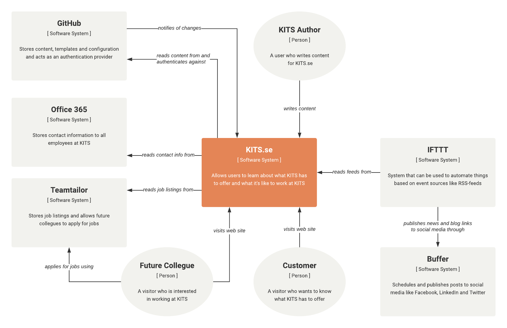

# KITS.se

This project contains the source code and content for <https://kits.se>.

## Overview

This project uses the static site generator [Gatsby](https://www.gatsbyjs.org) to create a web site. Previously [Jekyll](https://jekyllrb.com) was used but since most of the developers at KITS prefer JavaScript we've moved on to a React based solution instead.

The system context diagram below gives you an overview of how the different systems work together to create kits.se:

#### System Context Diagram



There are quite a few systems involved for such a simple site but if we look at a container diagram for KITS.se it may be easier to see how each of the systems are used to generate the final site.

#### Container Diagram


## Adding content

The easiste way to add content to the site is to use <https://kits.se/admin>. You can login using your GitHub account if you're a member of the KITS organization. The CMS is powered by [Netlify CMS](https://www.netlifycms.org) and all different content can be edited in a custom form for each type.

When you add content it will be saved as a new branch on GitHub and a pull request will be created. This means you can play with the content without publishing changes.

### Images

TODO...

## Development

You can use any editor for development (Visual Studio Code, Atom, WebStorm, IntelliJ, Vim, ...) but you should make sure that it supports the following technologies:

- [TypeScript](https://www.typescriptlang.org) – Since the project is written in TypeScript
- [EditorConfig](https://editorconfig.org) – To help the editor use the correct encoding, indentation, ...
- [Styled Components](https://www.styled-components.com) – To support styled component that we use for styling our components
- [Prettier](https://prettier.io) – To format the code according to our coding conventions

**The code is automatically formatted when you commit code. It is also linted before you push the commits to the server.**

For debugging purposes you should install [React Developer Tools](https://github.com/facebook/react-devtools).

### Preparations

- Install all required tools

  - Node 16.14– <https://nodejs.org>

- Checkout the code and fetch all dependencies
  ```
  $ git clone git@github.com:kits-ab/kits.git
  $ npm install
  ```

### Available scripts

When you've checked out the code and all dependencies have been fetched you probably want to run `npm start` but you can run any of the the following scripts:

- `npm run build` – Creates a production ready builds in `public/`
- `npm run clean` – Removes all generated files
- `npm run format` – Format the entire codebase using [Prettier](https://prettier.io)
- `npm run lint` – Lints all code with [TSLint](https://palantir.github.io/tslint) and [Stylelint](https://stylelint.io)
- `npm start` – Starts a local server with hot reloading enabled on <http://8000>

### GraphQL

All content that is read from Markdown, YAML or image files is exposed through GraphQL.

TODO...

### License

Copyright 2015-2022 KITS AB

Licensed under the Apache License, Version 2.0 (the "License"); you may not use this work except in compliance with the License. You may obtain a copy of the License in the LICENSE file, or at:

<http://www.apache.org/licenses/LICENSE-2.0>

Unless required by applicable law or agreed to in writing, software distributed under the License is distributed on an "AS IS" BASIS, WITHOUT WARRANTIES OR CONDITIONS OF ANY KIND, either express or implied. See the License for the specific language governing permissions and limitations under the License.
